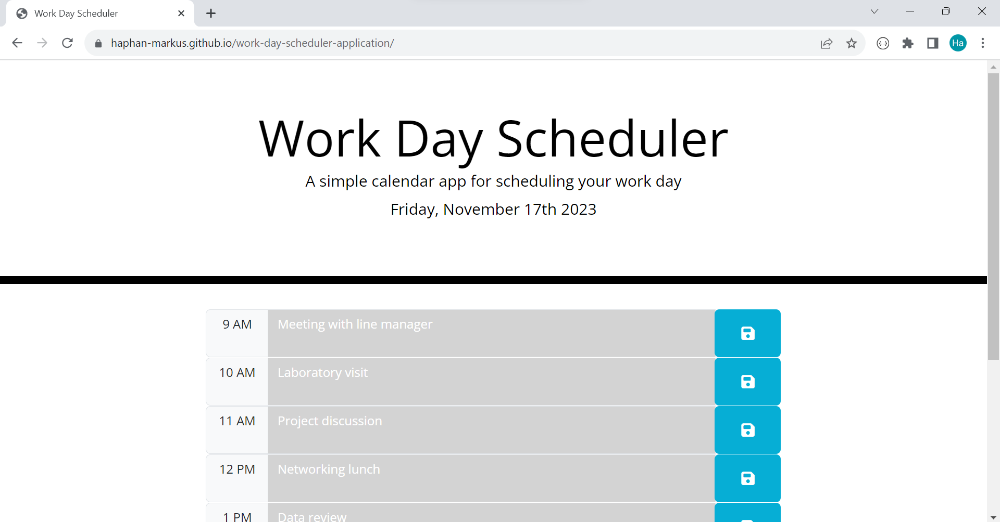
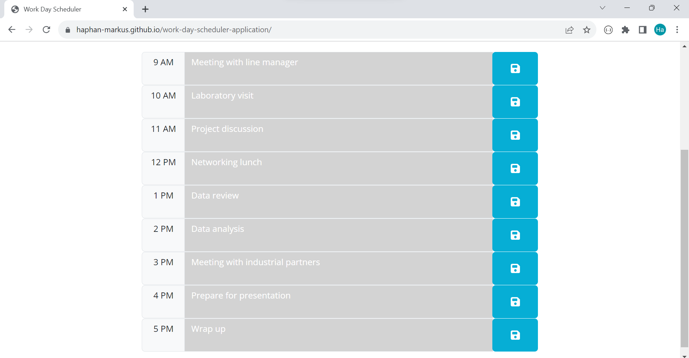
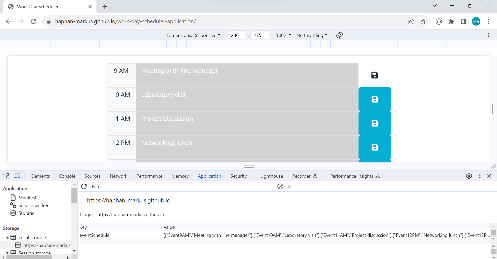
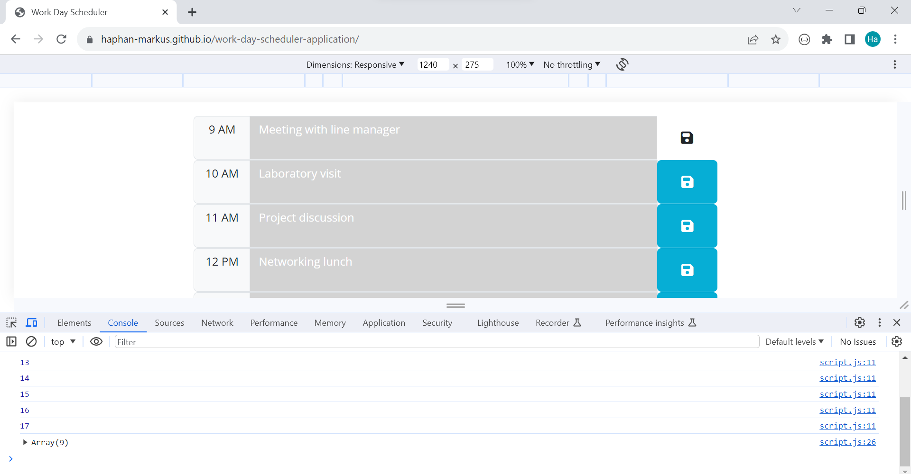

# Work Day Scheduler Application

## Description

Work Day Scheduler Application is a simple calendar application that allows a user to save events for each hour of the day. This app will run in the browser and feature dynamically updated HTML and CSS powered by jQuery. The events entered by the user will be stored in the local storage of the browser to ensure the user can access the schedule even after the browser is closed.

The date and time shown on the website is real-time update. The color of the time block will change according to the actual time at the location.

## User Story

```md
AS AN employee with a busy schedule
I WANT to add important events to a daily planner
SO THAT I can manage my time effectively
```

## Usage

The link to website: https://haphan-markus.github.io/work-day-scheduler-application/

## Visual

The website interface shows the current date when this picture is taken, Friday, November 17th, 2023. The time block color is grey since it is 19pm in the evening, indicating that it has passed the time of that timeblock.





Events are stored in local storage upon clicking the save button.





## Licence

[MIT](https://choosealicense.com/licenses/mit/)